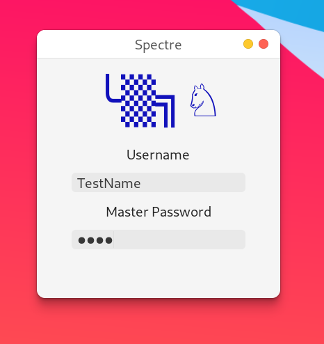
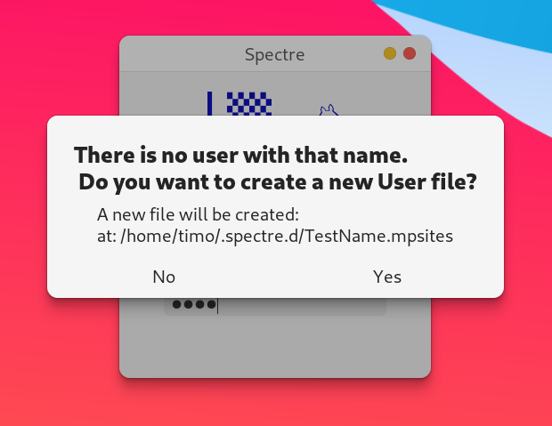
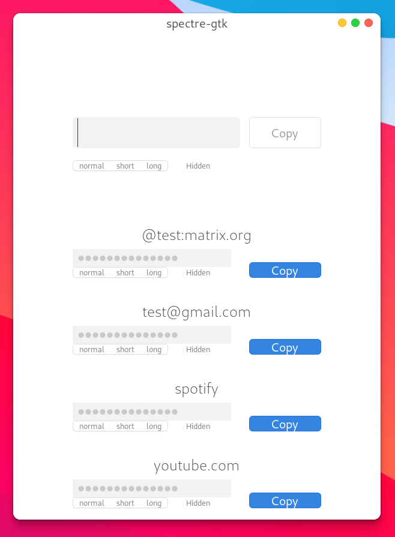
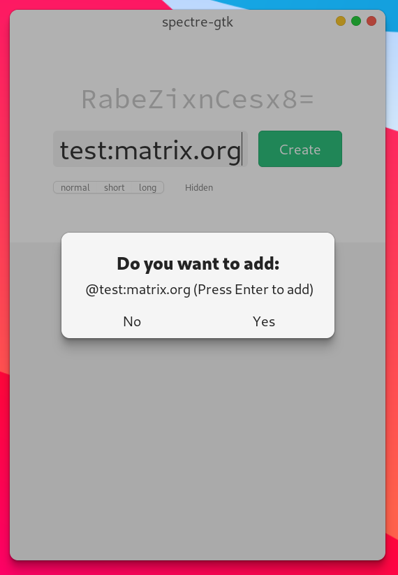
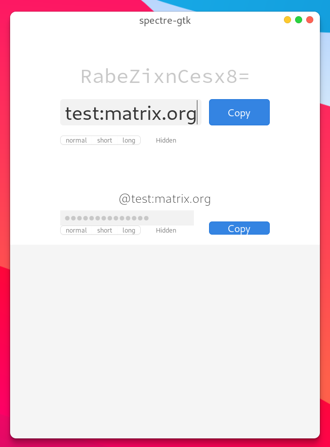

# Spectre GTK Frontend
A Gtk application using Rust. The masterpassword/Spectre algorithm is added via the Rust FFI. Using the new spectre api repository (https://gitlab.com/spectre.app/api)
(Spectre is the rebranded masterpassword algorithm)

## Current state
 - The FFI bindings are implemented and the api git submodule gets compiled by the build.rs script. The bindings can be further improved if the they should be come a standalone crate. For just this project they are good enough.
 - Saving the site list for a specific user on disk is working.
 - The gtk ui got ported to gtk4. It is close to the designs.
 - Filtering of the password list is implemented.
 - Overall the app is in a usable state. One big missing feature is the option to set the password type. For now all passwords are generated with the password type: long. Short, medium, maximum, ... are not given as an option in the ui.
 - The flatpak can be build using the rust extension and the `org.gnome.Platform` SDK. Or just downloaded and installed from the github releases section.

## Compile
Compile with cargo `cargo build`
For the flatpak build and installation use:
`./build-aux/flatpak-install.sh`
To only build the flatpak:
`./build-aux/flatpak-build.sh`
_To uninstall_
`flatpak remove com.github.spectre`
### The spectre c library
The specter c lib is using a linked git submodules: run `git submodule update --init --recursive` to download/add the files locally.
### Other requirements
for Bindgen there needs to be clang and libsodium installed (and maybe llvm devel packages) see: https://rust-lang.github.io/rust-bindgen/requirements.html
When using Flatpak this should all be available

## Screenshots
<!-- 

 

 -->

 

## Design plans

